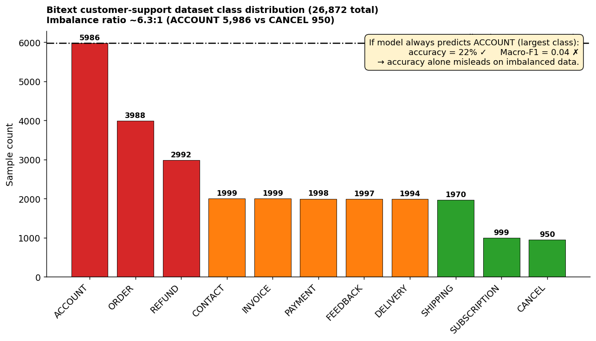
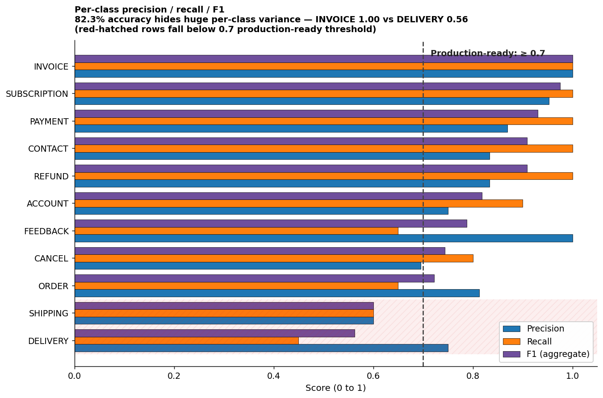
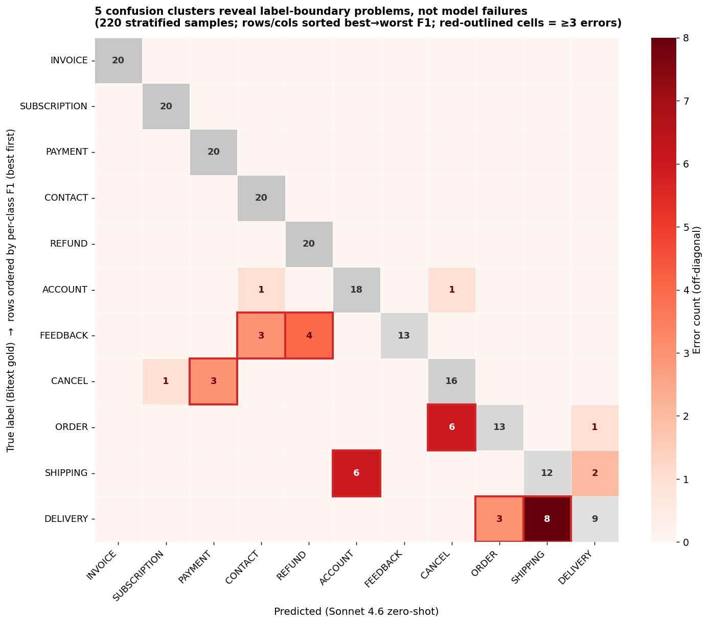
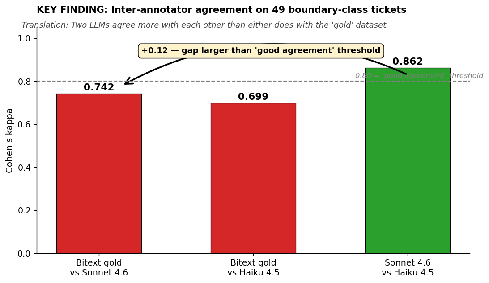

# Single-Label Classification

This is the simplest objective evaluation pattern. Each input maps to exactly one correct label. Examples: sentiment analysis (positive/negative), intent classification (one ticket → one department), routing an email to one team, or topic categorization (one article → one topic).

## Three flavors, one family

Classification problems come in three shapes that are often confused. They differ only in the label space:

- **Binary classification**: two classes (`positive`/`negative`, `spam`/`not spam`, `refund`/`not refund`). Special case of single-label.
- **Single-label multi-class classification**: more than two classes, but each item still gets exactly one label. Intent classification with 11 possible intents falls here.
- **Multi-label classification**: each item can have multiple labels at once. A single customer feedback message might be both `billing` and `urgent` and `refund`. Different metrics, different evaluation pattern; see [`../multi-label-classification/`](../multi-label-classification/README.md).

This page covers the first two. The metrics and intuitions are the same; only the number of classes changes.

## Choosing your metrics

Most teams default to accuracy and stop there. That works when classes are balanced. In real production data like support tickets, customer feedback, or content moderation, class imbalance is the norm, not the exception. Picking the wrong metric will hide real failures, and you need F1 score, precision, and recall to understand whether the agent is actually performing well on the minority classes or just predicting the majority class every time.

| Metric | What it measures | When to use | What it hides |
|---|---|---|---|
| **Accuracy** | Fraction of predictions that are correct | Classes are roughly balanced (≤ 2:1 ratio) and all classes equally important | Failures on rare classes when one class dominates |
| **Per-class precision** | Of predictions for class X, how many were actually X | You care about avoiding false positives for a specific class | Recall on that class |
| **Per-class recall** | Of actual class X items, how many did the agent find | You care about not missing a specific class | Precision on that class |
| **Per-class F1** | Harmonic mean of precision and recall for class X | You want a single number per class that punishes imbalanced precision/recall | Hides whether the failure is precision-side or recall-side, so always read F1 alongside the components |
| **Macro-F1** | Average F1 across classes, equal weight | Imbalanced data, all classes matter equally | Overall accuracy when majority class dominates |
| **Micro-F1** | F1 computed on pooled predictions across classes | Imbalanced data, but you care more about getting most predictions right | Per-class behavior |
| **Weighted F1** | Average F1 weighted by class frequency | You want one number that reflects production class distribution | Whether minority classes are working at all |

**Rule of thumb:** For any imbalanced dataset, report macro-F1 *and* per-class F1. The macro-F1 catches whether you are doing equally well across classes; the per-class F1 catches *which* class is the problem.

## A worked example: support ticket intent classification

Consider a customer support agent that classifies incoming tickets into one of 11 intent categories: `ACCOUNT`, `CANCEL`, `CONTACT`, `DELIVERY`, `FEEDBACK`, `INVOICE`, `ORDER`, `PAYMENT`, `REFUND`, `SHIPPING`, and `SUBSCRIPTION`. We evaluate on 220 samples drawn from the public [Bitext customer support dataset](https://huggingface.co/datasets/bitext/Bitext-customer-support-llm-chatbot-training-dataset), with 20 samples per class (a deliberately balanced evaluation set).

Note that production traffic for this kind of agent is rarely balanced. Real ticket distributions are skewed, with a few intents dominating and a long tail of rare categories. We balance the *evaluation* set on purpose so that every class gets equal scrutiny, then read macro-F1 (not accuracy) as the headline number because macro-F1 reports our average performance per class regardless of how often the class shows up in production.

A zero-shot Claude Sonnet classifier produces these aggregate numbers:

- **Accuracy:** 82.3%
- **Macro-F1:** 0.81

If you stopped here, you would ship. But the per-class F1 tells a different story:

| Class | F1 | Notes |
|---|---|---|
| INVOICE | 1.00 | Perfect |
| SUBSCRIPTION | 0.98 | Strong |
| PAYMENT | 0.93 | Strong |
| REFUND | 0.91 | Strong |
| CONTACT | 0.91 | Strong |
| ACCOUNT | 0.82 | Good |
| FEEDBACK | 0.79 | Acceptable |
| CANCEL | 0.74 | Borderline |
| ORDER | 0.72 | Borderline |
| SHIPPING | 0.60 | Weak |
| **DELIVERY** | **0.56** | **Failing** |

The per-class view surfaces what the aggregate metrics hide: `DELIVERY` and `SHIPPING` are getting confused with each other, and `ORDER` is being confused with `CANCEL`. Looking at the confusion matrix confirms this: 8 out of 20 `DELIVERY` tickets were misclassified as `SHIPPING`, and 6 out of 20 `ORDER` tickets were misclassified as `CANCEL`.

This is the production-relevant finding. Your agent is not 82% accurate uniformly; it has specific class-pair confusions that need attention. Possible fixes: clarify the class boundary in the prompt, add few-shot examples that distinguish the two, or merge the classes if the business doesn't actually need to distinguish them.

## When the classifier is an LLM

Classical ML classifiers (logistic regression, gradient boosting, fine-tuned transformers) produce a calibrated probability per class, and they behave the same way every time you run them on the same input. LLM classifiers don't, and that changes how you evaluate them. Four things to watch:

- **Output variance.** Same prompt, same input, different runs can give different labels, especially at the class boundaries. Set `temperature=0` for evaluation runs, but expect residual variance from sampling. Run each evaluation sample 3 times and report the majority label plus a stability rate.
- **Prompt sensitivity.** Changing the class definition by one word can swing per-class F1 by 10+ points. Treat the prompt as part of the evaluator: version it, diff it, and re-run the full evaluation set when it changes.
- **No calibrated probabilities.** An LLM that outputs `REFUND` doesn't tell you it's 0.83 confident. You can ask the model to emit a confidence score, but that score is itself a generated token, not a true posterior. Threshold-tuning tricks from classical ML don't transfer directly. Use abstain-and-route patterns instead: if the model emits low confidence or refuses to commit, escalate to a human reviewer.
- **Calibration drift.** The same prompt against the same model can produce different distributions of labels three months apart, because the model changed under the same alias. Pin the model id (`global.anthropic.claude-sonnet-4-6`, not `claude-sonnet`) and re-run evaluation when you upgrade.

For calibrating an LLM judge against human judgment, the same correlation-based pattern from [`subjective/human-alignment/`](../../subjective/human-alignment/README.md) applies. Even though classification is an objective task, the *labels themselves* may have been produced subjectively, and that subjectivity bleeds into your metrics.

## Ground truth quality is a prerequisite

Before you trust any metric, you have to trust your labels. Even objective metrics depend on label quality, and labels are often produced subjectively, by a human annotator, a heuristic, or a previous LLM. This is the most common failure mode for LLM classification evaluation in production.

A useful diagnostic is **Cohen's kappa** between two annotators on the same samples. Kappa measures agreement above chance. A kappa of 1.0 means perfect agreement, 0.0 means no better than random, and below 0.6 means the labels themselves are too noisy to trust. If your two human annotators only agree 60% of the time on what counts as `REFUND` vs `CANCEL`, no LLM will do better, and any metric you compute against either annotator's labels is misleading.

In the Bitext example above, we ran a 50-sample spot check and computed kappa across three pairs of annotators: Claude Sonnet, Claude Haiku, and the original Bitext labels. The Sonnet–Haiku kappa was 0.86, while the Bitext-original–Sonnet kappa was 0.74. Two LLMs agreed with each other more than either agreed with the dataset labels: a strong signal that the dataset itself has label noise on the class boundaries. The fix is not "tune the LLM more"; it's "audit the labels."

The broader calibration loop, how to verify that an automated scorer agrees with a human expert, is covered in [`subjective/human-alignment/`](../../subjective/human-alignment/README.md). That pattern is built for LLM-as-judge, but the underlying idea applies here: your labels are an evaluator, and you have to verify that they actually match what a domain expert would say before you trust any metric computed against them.

## A self-serve checklist

Before you ship a single-label classifier to production:

1. ☐ Compute the class distribution. If max:min ratio > 2:1, do not rely on accuracy alone.
2. ☐ Report per-class precision, recall, and F1, not just the aggregate.
3. ☐ Look at the confusion matrix. Identify the top 3 confused class pairs.
4. ☐ Spot-check 30–50 samples with a second annotator. Compute kappa. If kappa < 0.7, fix the labels before tuning the model.
5. ☐ For every class with F1 < 0.7, read 5 misclassifications and attribute the failure: prompt ambiguity, label noise, or genuine model limitation.
6. ☐ Set per-class confidence thresholds where the cost of error is asymmetric (e.g. abstain on low-confidence `REFUND` predictions and route to a human).

## When to escalate to human annotation

- Inter-annotator kappa < 0.6 → your class definitions are ambiguous; rewrite the labeling guide before continuing.
- A specific class consistently scores F1 < 0.5 across multiple prompt iterations → the class may be inherently hard or the boundary with a neighboring class may be wrong; consider merging classes or adding a domain expert review step in production.
- Small prompt changes cause large metric swings → your label set is noisy enough that the model is fitting noise; spot-check more samples and re-derive ground truth.
